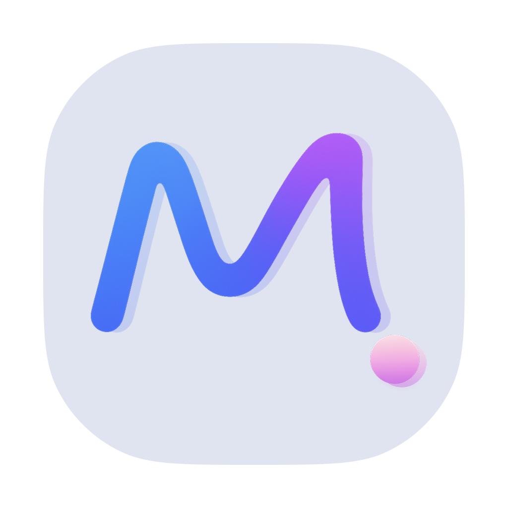

# Momentum

<p align="center">
  
</p>

<p align="center">
  <strong>Track your real work on macOS, locally and without noise.</strong><br/>
  Momentum turns active app, domain, and file context into clear project progress.
</p>

<p align="center">
  <a href="https://github.com/miguelgarglez/momentum/actions/workflows/ci.yml"></a>
  <a href="https://github.com/miguelgarglez/momentum/releases"></a>
  <a href="https://github.com/miguelgarglez/momentum/issues"></a>
</p>

## What is Momentum?

Momentum is a native macOS app that helps you understand where your time goes across personal and professional projects.

It is built as:
- a real product you can use every day
- an open public repository where feedback and contributions are welcome

## Why Momentum?

- **Automatic tracking with context**: tracks foreground apps, browser domains, and supported document files.
- **Manual live mode**: start focused manual tracking for a project when you need full control.
- **Conflict resolution**: if one context belongs to multiple projects, Momentum queues pending time and lets you resolve once with reusable rules.
- **Project analytics**: dashboard, weekly activity views, recent history, and streak-oriented summaries.
- **Menu bar first UX**: quick controls and status from the macOS status item, with smart Dock visibility.
- **Local-first privacy**: data stays on your Mac (SwiftData/SQLite), with privacy controls and optional protection settings.
- **Raycast integration**: local API + extension to list projects, start/stop manual tracking, and open conflict resolution.

## Product Status

Momentum is actively developed and already usable as a daily tool.  
Releases are published regularly, while the repo remains open for issues, ideas, and pull requests.

- Releases: https://github.com/miguelgarglez/momentum/releases
- Changelog: [CHANGELOG.md](CHANGELOG.md)
- Product docs and plans: [PRDs](PRDs/README.md)

## Installation

### Option 1: Download release build

Use the latest release assets from:
https://github.com/miguelgarglez/momentum/releases

### Option 2: Build from source

Requirements:
- macOS
- Xcode toolchain with Swift 6.2 support
- Make

Build and run:

```bash
make build
make run-dev
```

Useful development commands:

```bash
make test-unit
make test-ui
make lint
make format
make check-localization
```

## Raycast Extension

The repository includes a companion Raycast extension:

- Path: [`RaycastExtension/momentum`](RaycastExtension/momentum)
- Docs: [`RaycastExtension/momentum/README.md`](RaycastExtension/momentum/README.md)

From that folder:

```bash
npm run dev
npm run build
npm run lint
```

## Architecture at a Glance

High-level dependency direction:

`Views -> Services -> Models -> Utilities`

Main app code lives in:
- [`Momentum/Views`](Momentum/Views)
- [`Momentum/Services`](Momentum/Services)
- [`Momentum/Models`](Momentum/Models)
- [`Momentum/Utilities`](Momentum/Utilities)

## Contributing

Contributions are welcome. For substantial changes, open an issue first so we can align on product direction.

Recommended local checks before opening a PR:

```bash
make format-lint
make lint
make test-unit
make check-localization
```

Please also:
- use clear Conventional Commits (`feat:`, `fix:`, `chore:`...)
- include screenshots/recordings for UI changes
- describe manual testing done

## Feedback

If you use Momentum, your feedback is extremely valuable:

- Bug reports: https://github.com/miguelgarglez/momentum/issues/new
- Feature requests: https://github.com/miguelgarglez/momentum/issues/new
- General discussion: open an issue with context and use case

## License

A formal `LICENSE` file is not included yet.  
Until then, please open an issue before reusing substantial parts of the codebase outside contributions to this repository.
